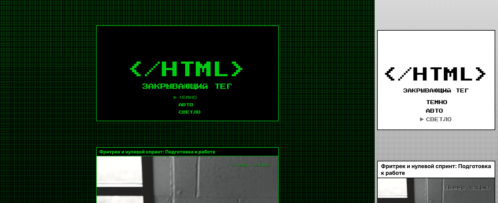

# Сайт-блог «Закрывающий тег»

Одностраничный адаптивный сайт «Закрывающий тег» представляет собой ретроспективу моего обучения верстки, этапы которого оформлены в виде карточек. На сайте есть анимированные кнопки и иконки, возможность переключать тему и ставить лайки карточкам.

Проект создан с целью освоения техник CSS-декорирования, включая трансформации, анимации, градиенты и фильтры. В проекте уделено внимание работе с SVG, их редактированию и анимации. Также реализовано HTML-модальное окно и темизированный фавикон, используются вариативные шрифты.

[Сайт на github-pages](https://anna-kobis.github.io/zakrivayuschiy-teg/) | [Макет в Figma](https://www.figma.com/design/JQhPLs2COLIeZtAtlsBS34/)

## Стек технологий

- Верстка на HTML5 и CSS3.
- Скрипты на JavaScript (ES6+).
